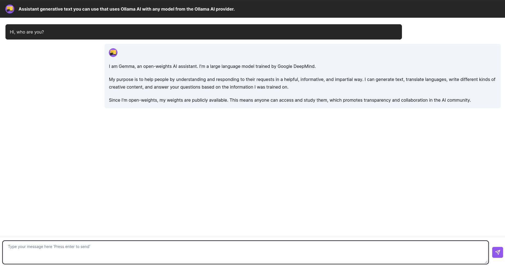

# NextKit ChatBot AI

Assistant generative text you can use that uses Ollama AI with any model from the Ollama AI provider.



## Technology Stack

- Next.js
- TypeScript
- Tailwind CSS
- Ollama AI
- SDK Vercel AI

## Usage
```ts
  const result = await streamText({
    model: ollama("gemma2"), // or any other Ollama AI model
    maxTokens: 1000,
    temperature: 0.7,
    messages
  });
```
## Requirements
You must have [Ollama](https://ollama.com/) installed on your computer.

## Start Project

1. Clone this repository
```bash
git clone https://github.com/aleksanderpalamar/nextkit-chatbot-ai.git
```

2. Install dependencies
```bash
cd nextkit-chatbot-ai
npm install
```

3. Start project
```bash
npm run dev
```

4. Open http://localhost:3000 in your browser

## Changelog

- 0.1.0: Initial release

## License

MIT License

Copyright (c) 2024 Aleksander Palamar